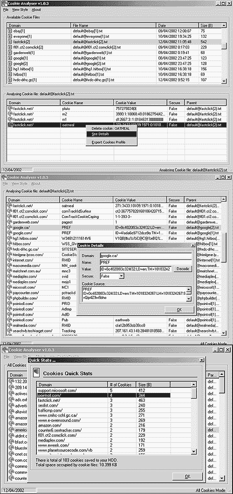



## Cookies Analyser 1\.03

### Description

This program helps you analyze your IE cookies. It shows cookie's details allows you to delete individual cookies or cookies based on certain domain. Gives you some quick stats about cookies and helps you to monitor what exactly you are receiving. It's quite nice and actually useful.
 
### More Info
 

             |
---                |---
**Submitted On**   |2002-04-15 21:26:04
**By**             |[Vladimir S\. Pekulas](https://github.com/Planet-Source-Code/PSCIndex/blob/master/ByAuthor/vladimir-s-pekulas.md)
**Level**          |Intermediate
**User Rating**    |4.5 (63 globes from 14 users)
**Compatibility**  |VB 3\.0, VB 4\.0 \(16\-bit\), VB 4\.0 \(32\-bit\), VB 5\.0, VB 6\.0
**Category**       |[Complete Applications](https://github.com/Planet-Source-Code/PSCIndex/blob/master/ByCategory/complete-applications__1-27.md)
**World**          |[Visual Basic](https://github.com/Planet-Source-Code/PSCIndex/blob/master/ByWorld/visual-basic.md)
**Archive File**   |[Cookies\_An724034152002\.zip](https://github.com/Planet-Source-Code/vladimir-s-pekulas-cookies-analyser-1-03__1-33747/archive/master.zip)

